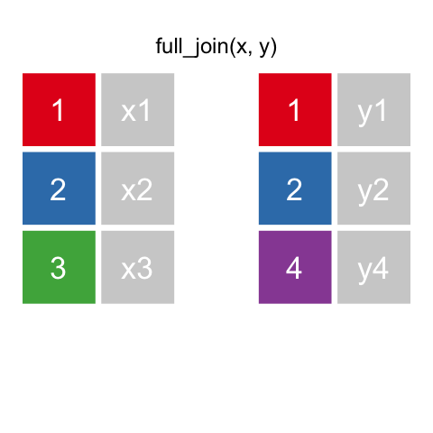
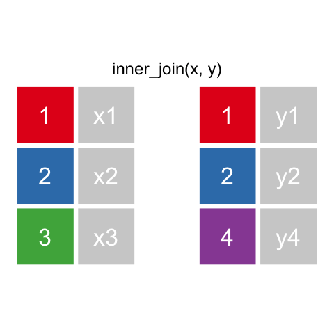

```{r setup, include=FALSE}
knitr::opts_chunk$set(echo = TRUE)
```

# {.tabset}

## R Terminology {.build}

Before we start, some terms/concepts are important to understand.

1. **Data types** - Under the hood, R stores information in a few different ways:

    - Integer - These are whole numbers
    - Numeric - Any number (can be a whole number)
    - String - Letters/words
    - Factor - Letters/words that are stored as numbers (we will touch on this later)
    - Time - Dates/times 
    
2. **Vectors** - Vectors in R are akin to lists. All data is stored in a vector and can be accessed by index/position. 
                 Most vectors are created using c("thing1","thing2",...,"thingn").

3. **Data frames/tibbles** - Dataframes and tibbles are conceptually equivalent to an Excel sheet. They store data in rows and columns.
4. **The pipe ( %>% )** - The pipe is a special symbol that allows us to write cleaner code by saying "put the output from the left function into the right function."

## Packages {.build .tabset}

### Installing packages
Packages provide a lot of the functionality that makes R so useful.
I've already installed all of the packages necessary to run this tutorial
but if you need to install them on your computer, just type
```{r install_sample, eval=FALSE}

#install.packages("PACKAGE_NAME",dependencies = TRUE)
```
If asked to compile packages, try the "Yes" option and, if it fails, redo with
the "no" option.
For packages from Bioconductor, just Google how to install.

### Loading Packages
First we load the core tidyverse package. This package includes: 

- **readr** - Reads in text files (.csv, .tsv)
- **tibble** - Makes dataframes (data structure with rows and columns)
- **tidyr** - Functions to clean up data
- **dplyr** - For manipulating/processing data.
- **stringr** - Functions to work with text
- **forcats** - Functions to work with factors (more details to follow)
- **purrr** - (Not covered) Helps replace for loops with easier to interpret code
- **ggplot2** - Make graphs/figures. We won't cover this in detail but will use ggplot output.

We also load the **ggrepel** package that helps format ggplot output.

```{r load packages, echo=TRUE, warning=FALSE, results="hide"}
library(tidyverse) 
library(ggrepel)

```


## Data In and Out {.tabset}
There are a lot of ways to get data into R, we will go over the readr and tibble packages


### Tibble

We can also manually create a tibble using a series of vectors. You simply specify the name of the column and the data corresponding to it.
```{r tibble}

OCH_tibble<-tibble::tibble(
  names=c("Claire","Cory","Rachael"),
  r_abil=c(10,5,8),
  height=c(165.1,187.96,158.75)
  )

print(OCH_tibble)

```

### Readr

We can also load data set using read_csv. This creates a dataframe/tibble object. 
Think of this as one sheet from an Excel file where data is stored in rows and columns.
Readr also has other functions for reading different file types (e.g. read_tsv). 
We can also write our data to an output file using various write_ functions.
```{r readr}

Gap_minder<-readr::read_csv("GM_code_along.csv")

print(Gap_minder)

readr::write_csv(OCH_tibble,"OCH.csv")

```

### Loading files with RStudio

Lastly, you can load files with RStudio. To do this, simply
navigate to the "Files" tab in the bottom right corner, find your file,
click on it and select "Import Dataset." To save, use one of the write_ 
functions mentioned above

## Dplyr {.tabset}

Next we will use functions from the dplyr package to manipulate our dataset.

### Select
Select can be used to pick columns to include or exclude
```{r select}
# Only include country, continent, year, and lifeExp columns
Gap_minder%>%
  dplyr::select(c(country, continent, year, lifeExp))%>%
  colnames()

#Exclude gdpPercap column
Gap_minder%>%
  dplyr::select(-gdpPercap)%>%
  colnames()

#Include columns that containt "co" (i.e. country and continent)
Gap_minder%>%
  dplyr::select(dplyr::contains(c("co")))%>%
  colnames()

#Reorder columns so year is first
Gap_minder%>%
  dplyr::select(year,dplyr::everything())%>%
  colnames()

#Select can be used to rename columns while filtering,
#or rename can be used to rename columns in place
Gap_minder%>%
  select(year, selected=country)%>%
  colnames()

Gap_minder%>%
  rename(renamed=country)%>%
  colnames()


```

### Filter
Filter is used to include or exclude rows based on some logical parameter. Say we just want to compare
GDP data for European countries within a certain year
```{r filter}
Europe_1992<-Gap_minder%>%
  dplyr::filter(dplyr::between(year, 1990,1994) & continent=="Europe")

ggplot2::ggplot(Europe_1992,aes(x=lifeExp,y=gdpPercap,fill=continent),colour="blue")+
  ggplot2::geom_point()+
  ggtitle("European Per Capita GDP 1992")+
  ggrepel::geom_text_repel(aes(x=lifeExp,y=gdpPercap,label=country))+
  ggplot2::xlim(c(65,80))+
  ggplot2::ylim(c(2000,35000))
```

You may also want to filter to compare two countries
```{r filter2}
Alb_France<-Gap_minder%>%
  filter( (country=="Albania" | country=="France") & year==1992)

ggplot(data=Alb_France,aes(x=lifeExp,y=gdpPercap,fill=continent),colour="Blue")+
  geom_point()+
  ggtitle("France & Albania Per Capita GDP 1992")+
  geom_text_repel(aes(x=lifeExp,y=gdpPercap,label=country))+
  xlim(c(65,80))+
  ylim(c(2000,35000))


```

Or identify and remove NA values
```{r filter3}
Gap_minder%>%
  filter(is.na(gdpPercap))

Gap_minder<- Gap_minder%>%
  filter(!is.na(gdpPercap))

#You could also use filter(country!="Coryland")
```


### Mutate
Mutate is used to add new columns to a tibble, usually based on calculations involving and existing column.
```{r mutate}

Gap_minder%>%
  mutate(gdptotal=gdpPercap*pop/(10^9))

Gap_minder%>%
  mutate(era=dplyr::if_else(year<2000,"20th","21st"))

Decades<-Gap_minder%>%
  mutate(era=dplyr::case_when(year<1960 ~ "50s",
                              year<1970 ~ "60s",
                              year<1980 ~ "70s",
                              year<1990 ~ "80s",
                              year<2000 ~ "90s",
                              year<2010 ~ "00s"))

ggplot(Decades,aes(x=era,y=lifeExp))+
  ggtitle("Life Expectancy by Decade")+
  geom_boxplot()+
  ggplot2::geom_jitter(aes(colour=continent,alpha=0.3),
              show.legend = FALSE)
  
# Check out mutate in the tidyverse ref manual for more useful functions such as
# lead and lag to grab the next or previous data point in a column or the cumulative
# series of functions

```

### Grouping and summarizing
Often, you want a number summarizing particular groupings of data, e.g. what was the population increase in each country over the period observed? You can get this with group_by, summarize, and mutate
```{r group_by}
#Arrange sorts in ascending order using the variable(s) listed. Use desc(variable) to do the opposite.
#Group_by creates groups based on the levels in the column(s) you specify and then you can use summarize or
#mutate to manipulate data based on those groups. Mutate keeps the previous data structure, 
#summarize makes a new, smaller dataset with one calculated value for each group.

#Summarize creates a smaller, summary tibble.
population_increase<-Gap_minder%>%
  dplyr::arrange(year)%>%
  dplyr::group_by(country)%>%
  dplyr::summarize(
    pop_inc=dplyr::last(pop)-dplyr::first(pop),
    continent=unique(continent))

population_increase

ggplot(population_increase,aes(x=continent,y=pop_inc,fill=continent),colour="black")+
  ggtitle("Population Change 1952 to 2007")+
  geom_violin()

#If you use mutate with group_by you add the values to
#the existing tibble.
Gap_minder%>%
  dplyr::arrange(year)%>%
  dplyr::group_by(country)%>%
  mutate(pop_inc=dplyr::last(pop)-dplyr::first(pop))

#You can group_by multiple variables
median_pop<-Gap_minder%>%
  dplyr::group_by(year, continent)%>%
  dplyr::summarize(med_pop=median(pop))

ggplot(median_pop,aes(x=year,y=med_pop,fill=continent,colour=continent))+
  ggtitle("Median Population by Year & Continent")+
  geom_point()+
  stat_smooth()


```

### Join
You can use joins to merge two tibbles along shared column(s)
```{r join}

OCH_tibble

food_tibble<-tibble::tibble(
  names=c("Claire","Rachael","Claus","Eduardo","Dariya"),
  r_abil=c(10,8,11,7,7),
  fave_fruit=c("grapes","apples","kiwi","plum","tomato")
  )

#Keep all data from left tibble
OCH_tibble%>%
  dplyr::left_join(food_tibble)


#Keep all data from right tibble
right_join(OCH_tibble,food_tibble)


#Keep all data
full_join(OCH_tibble,food_tibble)


#Keep all data with observations in both tibbles
inner_join(OCH_tibble,food_tibble)


#Filter out values from left tibble that aren't in right tibble
semi_join(OCH_tibble,food_tibble)


#Keep data that is unique to one tibble
anti_join(OCH_tibble,food_tibble)


```

## Other Packages {.tabset}
### Tidyr Pivot

Pivot_wide and pivot_long (formerly spread and gather) are helpful
for formatting data so it can be processed or visualized more
easily

```{r pivot}
#Pivot_wider and pivot_longer replaced spread 
#and gather in the newest version of tidyr.
#Code using the old functions is commented
#out below alongside the new functions

#Spread makes data wider
Gap_minder%>%
  select(country, pop, year)%>%
  tidyr::pivot_wider(names_from = year,
                     values_from = pop)
  
  #tidyr::spread(key=year,value=pop)
  
#Gather makes data longer
Gap_minder%>%
  select(country, pop, year)%>%
  tidyr::pivot_wider(names_from = year,
                     values_from = pop)%>%
  tidyr::pivot_longer(-country,
                      names_to="year",
                      values_to="pop"
                      )
  # tidyr::spread(key=year,value=pop)%>%
  # tidyr::gather(key=year,value=pop,-country)


```

### Tidyr Separate_Unite
Separate and unite are used to combine text across columns
```{r separate_unite}
food_tibble%>%
  tidyr::unite(name_foods,names,fave_fruit)

food_tibble%>%
  tidyr::unite(name_foods,names,fave_fruit)%>%
  tidyr::separate(name_foods,c("names","fave_fruit"))


```


### Stringr 
The stringr package has functions for processing text. Many of 
these take advantage of regular expressions (regex) which can 
be used to match complex patterns in a string variable.
```{r stringr}
#str_detect can be used to filter for a pattern. It returns a
#logical value (TRUE/FALSE)
Gap_minder%>%
  filter(year==1992,
         stringr::str_detect(country,"Al"))

#str_extract returns matches from a string
Gap_minder%>%
  mutate(short_cont=
           stringr::str_extract(continent,"[a-zA-Z]{3}")%>%
           toupper())

#str_replace_all can be used to swap one pattern for another
Gap_minder%>%
  mutate(new_country=
           stringr::str_replace_all(country,"[aeiou]","-"))

#str_detect can also be used to conditionally mutate 
labelled<-Gap_minder%>%
  filter(year==1992 & continent=="Europe")%>%
  mutate(country_label=if_else(
           stringr::str_detect(country,"Albania|France"),
           country,""))

ggplot(data=labelled,aes(x=lifeExp,y=gdpPercap,fill=continent),colour="Blue")+
  geom_point()+
  ggtitle("European Countries Per Capita GDP 1992")+
  geom_text_repel(aes(x=lifeExp,y=gdpPercap,label=country_label))+
  xlim(c(65,80))+
  ylim(c(2000,35000))

```

### Forcats
Factors are text-based data that typically involve multiple
observtions of the same text. R stores factors as integers,
and this sometimes complicates figures and data analysis. 
Forcats provides functions the handle factors.

```{r forcats}
#era is a factor here, but the order is off because R sorts 
#00s before 50s
ggplot(Decades,aes(x=era,y=lifeExp))+
  ggtitle("Life Expectancy by Decade")+
  geom_boxplot()+
  ggplot2::geom_jitter(aes(colour=continent,alpha=0.3),
              show.legend = FALSE)

#We can reorder the variable using fct_reorder!
Decades<-Decades%>%
  mutate(era=fct_reorder(era,year))

#You can also do the same manually with fct_relevel

# Decades<-Decades%>%
#   mutate(era=fct_relevel(era,"00s",after=Inf))

ggplot(Decades,aes(x=era,y=lifeExp))+
  ggtitle("Life Expectancy by Decade (Corrected)")+
  geom_boxplot()+
  ggplot2::geom_jitter(aes(colour=continent,alpha=0.3),
              show.legend = FALSE)

```

## Helpful Info {.tabset}

### Packages
You can find a package to solve any problem but here are a few ones that
I commonly use in my workflow:

**Science Related**

- **DESeq2** - Differential expression analysis (RNAseq)
- **pcr** - Analyze qPCR data
- **seqinr** - Work with biological data (fasta, fastq)
- **Rsamtools** - Work with BAM and SAM files
- **GenomicRanges** - Helpful for loading some biological data (GFF files)

**Figure Making**

- **ggforce** - Adds more functionality to ggplot
- **cowplot** - Makes ggplot output look nicer
- **colorspace** - Manage colors
- **RColorBrewer** - Incorporate better color palettes

**Data input/processing**

- **data.table** - Load and manipulate large data files much faster than tidyverse
- **broom** - Cleanup output from various r-functions (t.test, linear model)
- **Reticulate** - Integrate Python code with R code!
- **xlsx** - Load data from Excel files
- **readxl** - Load data from Excel files

### Tutorials

Here are some other links/tutorials that might be helpful

- [What I based this Code-Along on](https://www.analyticsvidhya.com/blog/2019/05/beginner-guide-tidyverse-most-powerful-collection-r-packages-data-science/)
- [Learn to use the data.table package](https://github.com/saghirb/WiP-rdatatable)
- [Introduction to Computational Biology/Bioinformatics](https://wilkelab.org/classes/SDS348_spring_2019.html)
- [R for Data Science](https://r4ds.had.co.nz/)
- [Fundamentals of Data Visualization](https://serialmentor.com/dataviz/)
- [Google "package_name vignette" for help with many packages](https://google.com)
- [Next week's topic: intro to ggplot](https://github.com/clairemcwhite/ggplot_intro)